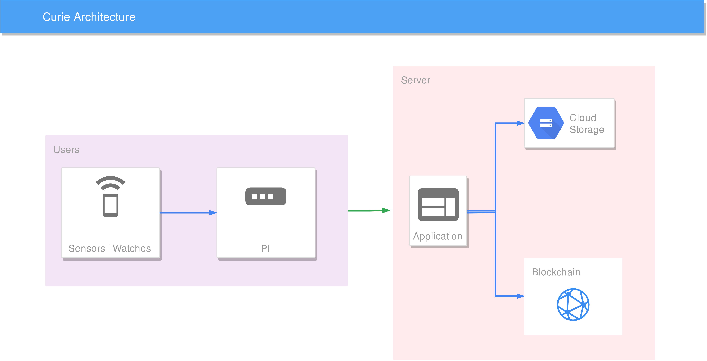

<p align="center">
    
</p>

<h1 align="center">Curie</h1>
<h3 align="center">:hospital: :fireworks: :alarm_clock:</h3>
<h4 align="center">A health monitoring device, which is smart, portable, and cheap.</h4>

1. [Problem](#about)
2. [Solution](#usage)
3. [Development](#development)
    1. [Pre Requisites](#pre-requisites)
    2. [Environment](#environment)
    2. [File Structure](#file-structure)
    3. [Build](#build)
4. [Contribution](#contribution)
5. [Resources](#resources)
6. [Gallery](#gallery)
7. [Credit](#credit)
8. [License](#license)

## Problem

**Heart attach kill over 3,75,000 people, alone in the USA**

We are least aware of our health and other problems of our body. Others solutions which are too much expensive or limitedly available.

## Solution

A Smart wearable device(Not a sports band), which will track and monitor health insights like Heartbeats, Temperature, Blood pressure, Oxygen level and monitor them remotely and track health risks.

- It will also send a VOIP call/Email to the selected doctor in case of an emergency

- Message to the nearest Doctor!

- Store data on a blockchain. (Public, Private)

- Predict future disease.

- Connect to alexa and google home. when user is in danger.

## Development

<p align="center">
    
</p>

#### Pre Requisites

`To Be Updated`

#### Environment

`To Be Updated`

#### Usage

1. Clone the repostory. `$ git clone https://github.com/xeon-zolt/curie`
2. Make start script executable. `$ chmod +x ./start`
3. Execute the script. `$ ./start`

#### File Structure

```console
.
├── app
│   ├── server.py
│   ├── static
│   │   └── img
│   │       └── logo.png
│   └── templates
│       └── index.html
├── README.md
├── requirements.txt
└── start
```

## Contribution

`To Be Updated`

## Resources

`To Be Updated`

## Gallery

`To Be Updated`

## Credit

- Raman Tehlan (Full-Stack Engineer)
- Harsh Lathwal (Software Engineer)
- Pranav Suri (Machine Learning and AI Engineer)
- Shivam Chaudhary (Hardware Engineer)
- Nikhil Kumar (Hardware Reverse Engineer)

## License

Proprietary (For Now)
